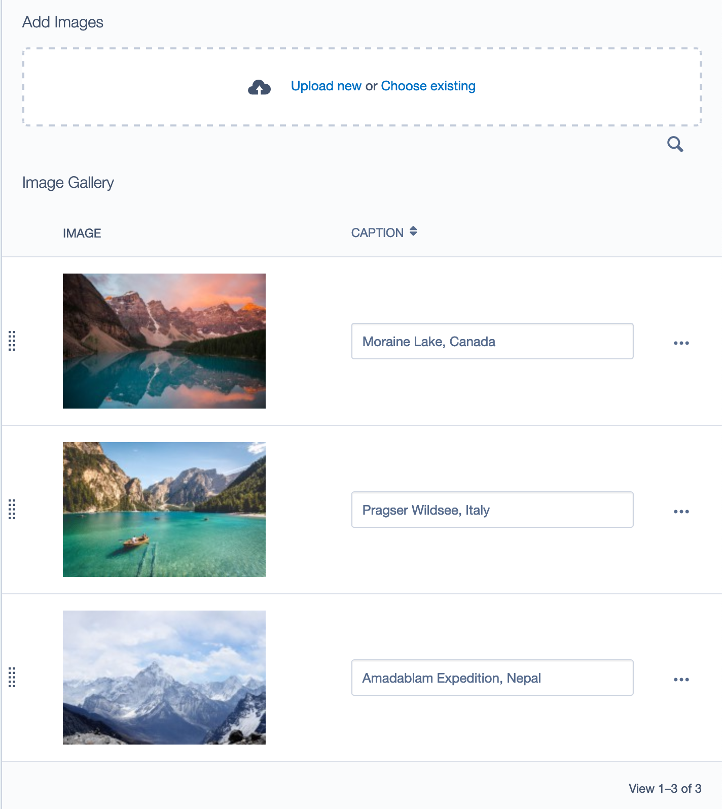

# Basic Image Gallery Extension

## Introduction

Add this extension to any page type, to get the following batch image upload interface in the CMS:



It allows images to be bulk uploaded, drag and drop reordering and inline caption adding.

Or use the following modules:
* [Basic Image Gallery Page](https://github.com/purplespider/silverstripe-basic-galleries) - Uses this extension to provide Image Gallery Page and Image Gallery Holder page types.
* [Basic Image Gallery Elemental Block](https://github.com/purplespider/silverstripe-elemental-basic-gallery) - Uses this extension to provide an Image Gallery Elemental block.

## Maintainer Contact ##
 * James Cocker (ssmodulesgithub@pswd.biz)
 
## Requirements
 * Silverstripe 4.1+
 
## Installation Instructions

````
composer require purplespider/silverstripe-basic-gallery-extension ^3
````

## v3 Upgrade Notes
Upgrading to v3 will break existing galleries due to a change to a polymorphic relation, to fix:
1. Run `dev/build`
2. Run `/dev/tasks/upgrade-basic-galleries` script.

## Config

The Extension can be applied to any page type to enable the gallery functionality.

You can also customise the CMS tab that the gallery appears on, as well as the title of the gallery displayed in the CMS, and rename the main Content tab:

````yml
---
Name: custom-basic-gallery-extension
After: basic-gallery-extension
---
HomePage:
  extensions:
    - PurpleSpider\BasicGalleryExtension\PhotoGalleryExtension
  gallery-title: Image Gallery
  gallery-cms-tab: Main
  content-cms-tab: Top Content
````
### Automatically Delete Image Files
To automatically delete image files when an image is deleted from a gallery:
````yml
---
Name: custom-basic-gallery-extension
After: basic-gallery-extension
---
PurpleSpider\BasicGalleryExtension\PhotoGalleryImage:
  ondelete_delete_image_files: true
````
This uses [Delete Asset If Unused Extension](https://github.com/purplespider/asset-delete-if-unused-extension) to detect if the image is being used elsewhere on the site, and will only delete it if it isn't. There are caveats though, so check this module's readme, i.e. you might not want to use this on sites that have been upgraded from Silverstripe 3.
