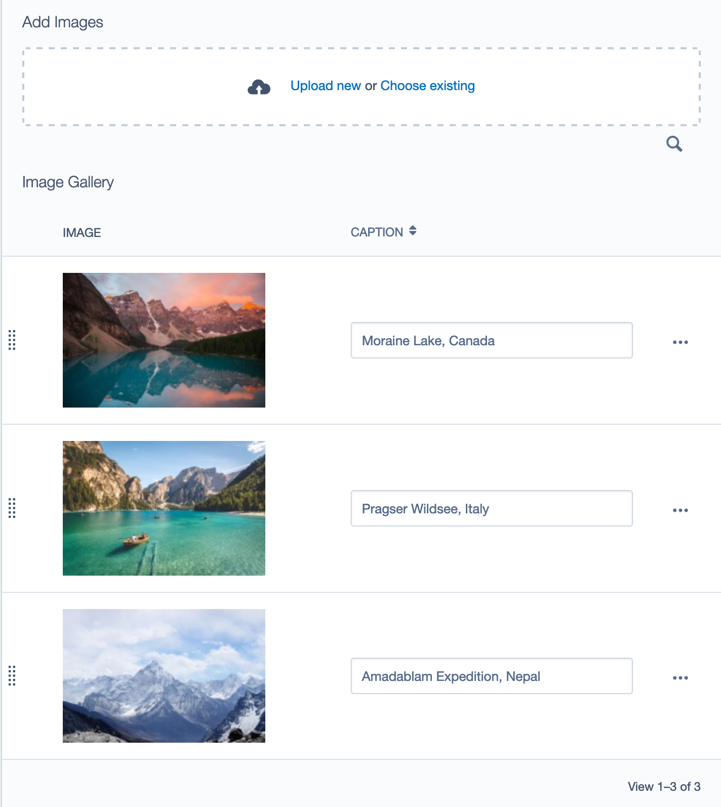

# Basic Image Gallery Extension for Silverstripe

## Introduction

Add this extension to any page type, to get the following batch image upload interface in the CMS:



It allows images to be bulk uploaded, drag and drop reordering, automatic ordering by filename or date, and inline caption adding.

Or use the following modules:

-   [Basic Image Gallery Page](https://github.com/purplespider/silverstripe-basic-galleries) - Uses this extension to provide Image Gallery Page and Image Gallery Holder page types.
-   [Basic Image Gallery Elemental Block](https://github.com/purplespider/silverstripe-elemental-basic-gallery) - Uses this extension to provide an Image Gallery Elemental block.

## Maintainer Contact

-   James Cocker (ssmodulesgithub@pswd.biz)

## Requirements

-   Silverstripe 6


## Image Order

Each gallery has an **Image order** dropdown, shown below the image grid in the CMS:

-   **Custom (drag and drop)** - the default, and how galleries have always worked
-   **Filename (A-Z)** / **Filename (Z-A)**
-   **Date added (oldest first)** / **Date added (newest first)**

Choosing anything other than Custom hides the drag handles and re-orders the images when the page is saved. Filenames are compared naturally, so `DSC_2.jpg` sorts before `DSC_10.jpg` rather than after it.

The chosen order is applied by rewriting each image's `SortOrder`, so **no template changes are needed** - anything already looping `PhotoGalleryImages` picks up the new order automatically. Existing galleries are untouched: with no order stored they fall back to Custom.

A database build (`sake db:build`) is required after upgrading, to add the `GallerySortMode` field.

### Changing the Default Order

The default applies to any gallery that hasn't had an order chosen yet, including galleries created before this setting existed. Set it site-wide:

```yml
---
Name: custom-basic-gallery-extension
After: basic-gallery-extension
---
PurpleSpider\BasicGalleryExtension\PhotoGalleryExtension:
    default_gallery_sort_mode: 'FilenameAsc'
```

or for one page type only:

```yml
PurpleSpider\BasicGalleries\PhotoGalleryPage:
    default_gallery_sort_mode: 'CreatedDesc'
```

Valid values are `Custom`, `FilenameAsc`, `FilenameDesc`, `CreatedAsc` and `CreatedDesc`.

### Adding Your Own Order

`gallery_sort_modes` lists the modes offered in the dropdown. Because Silverstripe merges config arrays rather than replacing them, adding a mode in YAML is enough to make it appear; to *remove* one, use the `updateGallerySortModes` extension hook.

To make a new mode actually do something, implement `updateSortedGalleryImages($images, $mode, $sorted)` on the owner: reorder `$images` and set `$sorted` to `true`. Modes that nothing claims leave `SortOrder` untouched rather than being silently renumbered. The same hook can be used to adjust one of the built-in orders.

## v3 Upgrade Notes

Upgrading to v3 will break existing galleries due to a change to a polymorphic relation, to fix:

1. Run `dev/build`
2. Run `/dev/tasks/upgrade-basic-galleries` script.

## Config

The Extension can be applied to any page type to enable the gallery functionality.

You can also customise the CMS tab that the gallery appears on, as well as the title of the gallery displayed in the CMS, and rename the main Content tab:

```yml
---
Name: custom-basic-gallery-extension
After: basic-gallery-extension
---
HomePage:
    extensions:
        - PurpleSpider\BasicGalleryExtension\PhotoGalleryExtension
    gallery-title: Image Gallery
    gallery-cms-tab: Main
    content-cms-tab: Top Content
```

### Automatically Delete Image Files

To automatically delete image files when an image is deleted from a gallery:

```yml
---
Name: custom-basic-gallery-extension
After: basic-gallery-extension
---
PurpleSpider\BasicGalleryExtension\PhotoGalleryImage:
    ondelete_delete_image_files: true
```

This uses [Delete Asset If Unused Extension](https://github.com/purplespider/asset-delete-if-unused-extension) to detect if the image is being used elsewhere on the site, and will only delete it if it isn't. There are caveats though, so check this module's readme, i.e. you might not want to use this on sites that have been upgraded from Silverstripe 3.
